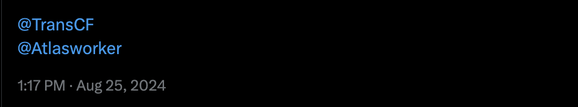

##
## جمع‌آوری داده
ما از راه‌های گوناگون داده‌ی نهادهای مدنی را جمع‌آوری می‌کنیم. برای مثال در x.com ربات رهگیر ما به پیام‌هایی که در آن منشن شده باشد واکنش نشان می‌دهد؛ کافی‌ست نام نهادی که می‌خواهید به ما معرفی کنید را همراه با نام ربات پست کنید:

## نگه‌داری داده
بسیاری از اطلاعاتی که ما در مورد نهادها جمع‌آوری می‌کنیم در طول زمان تکمیل می‌شوند و تغییر می‌یابند. تمیزکردن این داده و به‌روز نگه‌داشتن آن بخشی جدایی‌ناپذیر از کارهای اطلس است.

## پایش
بخشی از اطلاعات نهادها به صورت همگانی در دسترس ما نیستند. برای دست‌یابی به این اطلاعات ما به خود نهادها رجوع می‌کنیم و از راه پرسش‌نامه‌ها و در ارتباط با ایشان پروفایل‌ها را تکمیل می‌کنیم. طراحی این پرسش‌نامه‌ها و انجام پایش بخشی از کارهای اطلس است.

## توسعه‌ی نرم‌افزاری اطلس
نرم‌افزارهای اطلس نیاز به توسعه‌ی مداوم دارند. بخش مربوط به نمودارها، وب‌سایت اطلس، تحلیل داده‌ و ... همه نیازمند توان برنامه‌نویسی‌اند.

